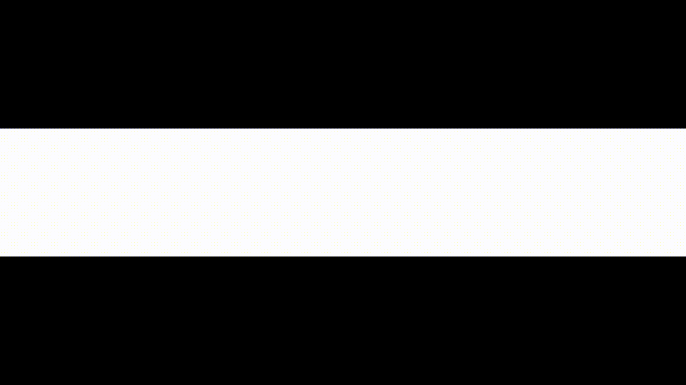

# Live Stats Dashboard

A SvelteKit application that renders **live broadcast graphics** for GameWaves League of Legends esports productions. It connects to a live match through an external stats backend, streams in-game data over Server-Sent Events (SSE), and drives on-air visuals (player spotlights, team damage breakdowns, socials) with animated stinger transitions — branded per league.

> Built with Svelte 5 (runes mode), SvelteKit 2, TypeScript, and Tailwind CSS v4.

---

## Demo

<!-- TODO: Replace with a real demo GIF.
     Record the on-air output (a stinger-in → live visual → stinger-out cycle),
     export as a GIF or short MP4, drop it in docs/ (e.g. docs/demo.gif),
     and update the path below. -->

<p align="center">
  
</p>

---

## Features

- **Live match connection** — connect to a running match by ID and start streaming stats.
- **On-air visual output** (`/activeVisuals`) — an OBS/browser-source-style page that listens for `animateIn` / `animateOut` / `refreshAssets` relay events over SSE and renders the matching visual with stinger animations.
- **Visual configuration** (`/configureVisuals`) — create and edit visuals: set a label, pick a team and role, and choose up to four stats per visual, then persist the config to the backend.
- **Per-league theming** — visual style (`ROL` / `NLC`) selects branded logos, backgrounds, and role icons. The active style is detected from the connected match and stored client-side.
- **Champion art preloading & caching** — splash and square art are preloaded from the CDN to avoid pop-in during live transitions.

## Tech stack

| Concern        | Choice                                  |
| -------------- | --------------------------------------- |
| Framework      | SvelteKit 2 + Svelte 5 (runes)          |
| Language       | TypeScript                              |
| Styling        | Tailwind CSS v4                         |
| Build tool     | Vite 7                                  |
| Adapter        | `@sveltejs/adapter-auto`                |
| Formatting     | Prettier (+ Svelte & Tailwind plugins)  |

---

## How it works

The frontend is a thin rendering and configuration layer over an **external stats backend** (referred to in the UI as the DataMonster Dashboard). The backend base URL is supplied via `PUBLIC_SERVER_URL`.

| Route               | Purpose                                                                                     |
| ------------------- | ------------------------------------------------------------------------------------------- |
| `/`                 | Connect to a live match by ID. Confirms the match exists in the backend and detects the league/visual style. |
| `/activeVisuals`    | The on-air output. Subscribes to the relay SSE stream and renders stingers + the active visual. |
| `/configureVisuals` | Load, edit, and save visual configurations (team, role, stats).                              |

### Backend endpoints consumed

All paths are appended to `PUBLIC_SERVER_URL` (which **must include a trailing slash** — see below):

| Method | Endpoint                              | Used by              | Purpose                                  |
| ------ | ------------------------------------- | -------------------- | ---------------------------------------- |
| `POST` | `connectMatch/{matchId}`              | `/`                  | Connect to a live match.                 |
| `GET`  | `prepareVisuals`                      | `/configureVisuals`  | Load configured visuals.                 |
| `PUT`  | `prepareVisuals`                      | `/configureVisuals`  | Save an updated visual config.           |
| `GET`  | `companionRelay/stream` (SSE)         | `/activeVisuals`     | Receive `animateIn` / `animateOut` / `refreshAssets` events. |
| `GET`  | `{visualType}/{visualName}`           | `/activeVisuals`     | Fetch a visual's data (`defaultVisuals` or `customVisuals`). |

---

## Prerequisites

- **Node.js** 18+ (or the version your deploy target requires)
- **npm**
- A running instance of the **stats backend** reachable at `PUBLIC_SERVER_URL`

## Installation

```sh
# 1. Install dependencies
npm install

# 2. Create a .env file in the project root (see Environment variables below)

# 3. Start the dev server
npm run dev

# ...or open it in a new browser tab automatically
npm run dev -- --open
```

The dev server runs on Vite's default port (`http://localhost:5173`).

---

## Environment variables

Defined in a `.env` file at the project root. Both are **public** (`PUBLIC_` prefix) and are imported via `$env/static/public`, so they are inlined into the client bundle at build time — do not put secrets here.

| Variable            | Required | Example                                                  | Description                                                                 |
| ------------------- | -------- | -------------------------------------------------------- | --------------------------------------------------------------------------- |
| `PUBLIC_SERVER_URL` | Yes      | `http://localhost:3000/`                                 | Base URL of the stats/relay backend. **Must end with a trailing `/`** — paths are concatenated directly (e.g. `${PUBLIC_SERVER_URL}prepareVisuals`). |
| `PUBLIC_CDN_URL`    | Yes      | `https://cdn.communitydragon.org/latest/champion/`       | Base URL for champion art (square + splash). **Must end with a trailing `/`.** |

Example `.env`:

```dotenv
PUBLIC_SERVER_URL='http://localhost:3000/'
PUBLIC_CDN_URL='https://cdn.communitydragon.org/latest/champion/'
```

> ⚠️ Because these are inlined at build time, changing them requires a restart of the dev server (or a rebuild for production).

---

## Usage

### Available scripts

| Script                | Description                                            |
| --------------------- | ------------------------------------------------------ |
| `npm run dev`         | Start the Vite dev server.                             |
| `npm run build`       | Build a production version of the app.                 |
| `npm run preview`     | Preview the production build locally.                  |
| `npm run check`       | Type-check the project with `svelte-check`.            |
| `npm run check:watch` | Type-check in watch mode.                              |
| `npm run lint`        | Check formatting with Prettier.                        |
| `npm run format`      | Auto-format the codebase with Prettier.                |

### Typical workflow

1. **Connect a match** — open `/`, enter the match ID, confirm the match exists in the backend dashboard, and submit. The app detects the league (`NLC` vs `ROL`) from the connected match and themes the UI accordingly.
2. **Configure visuals** — open `/configureVisuals` to edit a visual: rename it, pick a team and role, and toggle up to four stats. Saving persists the config to the backend.
3. **Go on air** — point your broadcast tool (e.g. OBS browser source) at `/activeVisuals`. The page listens to the relay stream and animates visuals in and out as `animateIn` / `animateOut` events arrive.

### Building for production

```sh
npm run build
npm run preview   # smoke-test the production build
```

The project uses `@sveltejs/adapter-auto`, which detects supported deploy targets automatically. For an unsupported or fixed environment, swap in a specific [adapter](https://svelte.dev/docs/kit/adapters) in `svelte.config.js`.

---

## Project structure

```
src/
├─ lib/
│  ├─ activeVisual.svelte.ts     # Reactive class: fetches & holds a single visual's live data
│  ├─ sseStream.svelte.ts        # Reactive EventSource wrapper
│  ├─ visualAssetsConfig.ts      # Per-league (ROL/NLC) logos, backgrounds, role icons
│  ├─ components/
│  │  ├─ visuals/                # Spotlight, TotalDamage, Socials, stingers, etc.
│  │  └─ ui/                     # Reusable UI primitives (Heading, Notice, DropDown, …)
│  ├─ server/
│  │  ├─ schemas.ts              # Shared API/visual types
│  │  └─ staticInfo.ts           # Allowed stats, teams, roles
│  └─ utils/                     # Small helpers (calcPercentage, getVisualStyle, …)
└─ routes/
   ├─ +page.svelte               # Connect-to-match screen
   ├─ activeVisuals/             # On-air output (SSE-driven)
   └─ configureVisuals/          # Visual configuration UI
```

---

## Notes

- The app expects the backend to be reachable and serving the endpoints listed above; with no backend, the connect and configure flows will error.
- "Export Bitfocus Configuration" on the configure page is not yet implemented.
```